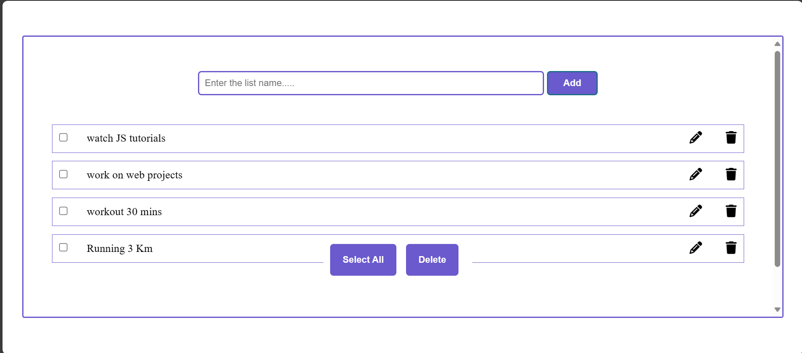

# To-Do List Application :clipboard:

## Overview :clipboard:

The To-Do List Application is a user-friendly web tool that empowers you to manage your tasks efficiently. It provides a clear and organized interface for adding, editing, and deleting tasks. Stay organized and boost your productivity with this simple yet effective to-do list!

## Features :rocket:

- **Task Management:** Add, edit, and delete tasks with ease.

- **Checkboxes:** Mark tasks as complete or incomplete using intuitive checkboxes.

- **Content Editing:** Edit task names directly by clicking on them.

## Usage :computer:

1. Open the `index.html` file in your preferred web browser.

2. In the input field, enter the task you want to add to your to-do list.

3. Click the "Add" button to add the task to your list.

4. To mark a task as complete, click the checkbox next to it.

5. To edit a task, click on its name, make your changes, and press "Enter" to save.

6. To delete a task, click the trash icon next to it.

7. Use the "Select All" button to mark all tasks as complete.

8. Use the "Delete" button to remove selected tasks from the list.

Enjoy a more organized and productive day with the To-Do List Application!

## Technical Details :wrench:

- **Technologies Used:** HTML, CSS, JavaScript

- **Task Management:** Tasks are dynamically added and removed from the list.

- **Content Editing:** Task names can be edited in-place for quick updates.

## Contributing :handshake:

Contributions and suggestions are welcome! If you have ideas to enhance this to-do list application, feel free to open an issue or submit a pull request.
